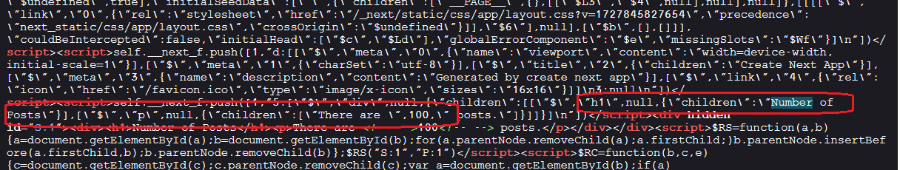

<h2>Project Description</h2>
This project showcases the power of React Server Components in Next.js to handle <strong>dynamic data fetching</strong>, <strong>error management</strong>, and <strong>loading state handling</strong>. It demonstrates server-side data fetching, error management, and dynamic UI rendering using Next.js components.

<h2>Motivation</h2>
Building upon the foundation established in the <a href='#references'>references</a>, this project delves deeper into RSC's capabilities for dynamic data fetching. Unlike SSG (static site generation), which doesn't necessitate error and loading states (as data is pre-fetched during build time), SSR (Server Side Rendering) requires careful handling of these states to deliver a seamless user experience. This project tackles essential questions:

<ul>
    <li>How to implement dynamic data fetching using RSC in Next.js.</li>
    <li>How to handle errors effectively within server components to ensure a smooth UX.</li>
    <li>How to render appropriate loading states while server components are fetching data.</li>
</ul>

<h2>Installation</h2>

```bash
pnpm i
```

<h2>Usage</h2>
<p>Start the development server:</p>

```bash
pnpm run dev
```

<h3>Simulating Error Handling</h3>

To test error handling functionality, replace the <code>GOOD_POSTS_URL</code> constant with an invalid URL - <code>BAD_POSTS_URL</code>. This will trigger a fetch error, allowing you to observe how errors are gracefully managed and displayed.

<h2>Home page</h2>
<p>The main entry point for rendering the <code>PostsCount</code> component:</p>

```ts
export default function Home() {
  return (
    <div>
      <PostsCount/>
    </div>
  );
}
```

<h2>PostsCount - react server component</h2>
This component fetches post data from the server and displays the count

```ts
async function fetchPosts() {
  await pauseMs(2000); // --- pause just so we can see loader
  const res = await fetch(GOOD_POSTS_URL);
  if (!res.ok) throw new Error("Failed to fetch posts");

  const posts = await res.json();
  return posts.length;
}

export default async function PostsCount() {
  const postCount = await fetchPosts();
  return (
    <div>
      <h1>Number of Posts</h1>
      <p>There are {postCount} posts.</p>
    </div>
  );
}
```

<h2>loading.tsx</h2>
<p>This file is placed in the <code>Home</code> page directory. It is called and rendered by Next.js framework while the <code>PostsCount</code> component is still loading.</p>


```ts
const Loading: FC = () => {
  return <p>Loading...</p>;
};
```

<h2>error.tsx</h2>
This file is placed in the Home page directory. It is called by the Next.js framework when <code>PostsCount</code> throws an exception

```ts
const Error: FC<ErrorProps> = ({ error, reset }) => {
  return (
    <div>
      <h1>Something went wrong!</h1>
      <p>{error.message}</p>
      <button onClick={() => reset()}>Try again</button>
    </div>
  );
};
```

<h2>Demo - Loading</h2>
This image show the UI while PostsCount fetch data


<h2>Demo - After Loading</h2>
This image show the UI after PostsCount finished fetching data


<h2>Error</h2>
This image show the UI after PostsCount throws exception


<h2>SSR in action</h2>
Using "View Source," you can clearly see that the fetch result is rendered dynamically as html on the server (SSR) and send to the browser for display



<h2 id="references">References</h2>
<ul>
    <li id='ref1'><a href='https://youtu.be/7WhcpereZkQ'>Mastering Server vs. Client Components in Next.js! </a></li>
    <li id='ref2'><a href='https://youtu.be/ck8ZEuPmhSM'> RSC vs RCC: Data Fetching Showdown (with Code Examples) </a></li>
</ul>
