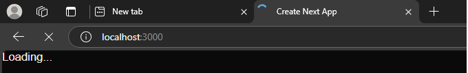
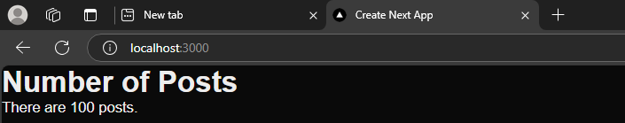
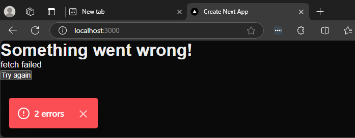

<h2>Project Description</h2>
This project demonstrates the use of React Server Components (RSC) in Next.js to handle dynamic server-side rendering (SSR) with proper error and loading states. The project includes server-side data fetching, error handling, and dynamic rendering using Next.js components.


<h2>Motivation</h2>
  In the first two references, <a href='#ref1'>[1]</a> and <a href='#ref2'>[2]</a>, we explored RSC vs RCC for 'hello world' and static data fetching (SSG). Now, it’s time to fetch data dynamically (SSR) using RSC. Unlike SSG (build time), where there’s no need to handle errors and loading states, SSR requires proper handling for a better user experience. This project addresses the following key questions:

<ul>
<li>how to do it in next.js ??</li>
<li>how to handle error in server component ?</li>
<li>how to handle loading in server component ??</li>
</ul>


<h2>Installation</h2>

```bash
pnpm i
```


<h2>Usage</h2>

```bash
pnpm run dev
```
<p>Use the following setup to test error handling: replace <code>GOOD_POSTS_URL</code> with <code>BAD_POSTS_URL</code> to issue an error.</p>


<h2>Home page</h2>

```ts

export default function Home() {
  return (
    <div>
      <PostsCount/>
    </div>
  );
}
```

<h2>PostsCount - react server component</h2>
This component fetches post data from the server and displays the count

```ts
async function fetchPosts() {
  await pauseMs(2000); // --- pause just so we can see loader
  const res = await fetch(GOOD_POSTS_URL);
  if (!res.ok) throw new Error('Failed to fetch posts');
  
  const posts = await res.json();
  return posts.length;
}

export default async function PostsCount() {
  const postCount = await fetchPosts();
  return (
    <div>
      <h1>Number of Posts</h1>
      <p>There are {postCount} posts.</p>
    </div>
  );
}

```

<h2>loading.tsx</h2>
This file is placed in the Home page directory. It is called by the Next.js framework as long as <code>PostsCount</code> has not finished loading


```ts
const Loading: FC = () => {
  return <p>Loading...</p>;
};
```


<h2>error.tsx</h2>
This file is placed in the Home page directory. It is called by the Next.js framework when <code>PostsCount</code> throws an exception


```ts
const Error: FC<ErrorProps> = ({ error, reset }) => {
  return (
    <div>
      <h1>Something went wrong!</h1>
      <p>{error.message}</p>
      <button onClick={() => reset()}>Try again</button>
    </div>
  );
};
```


<h2>Demo - Loading</h2>



<h2>Demo - After Loading</h2>


<h2>Error</h2>



<h2 id="references">References</h2>
<ul>
    <li id='ref1'><a href='https://youtu.be/7WhcpereZkQ'>Mastering Server vs. Client Components in Next.js! </a></li>
    <li id='ref2'><a href='https://youtu.be/ck8ZEuPmhSM'> RSC vs RCC: Data Fetching Showdown (with Code Examples) </a></li>
</ul>

